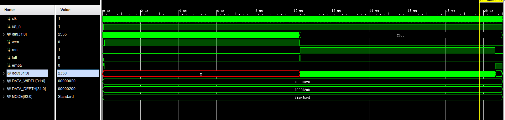
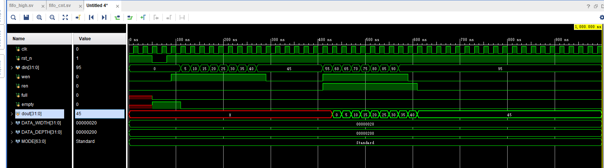
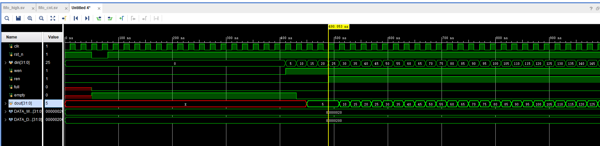
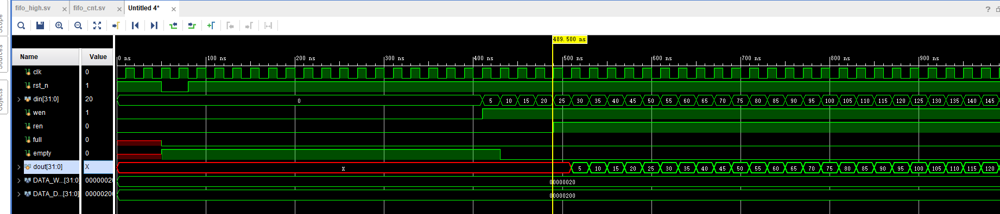

# Sync FIFO设计

### 设计目标

​	完成一个深度512，位宽32的同步fifo设计，要求实现first word fall through。

### 附加

​	实现可编程的水位线，读写fifo握手信号

## 学习记录
学习博客：
https://blog.csdn.net/wuzhikaidetb/article/details/121136040

FIFO 与普通存储器 RAM 的区别是没有外部读写地址线，使用起来非常简单，但缺点就是只能顺序写入数据，顺序的读出数据，其数据地址由内部读写指针自动加 1 完成，不能像普通存储器那样可以由地址线决定读取或写入某个指定的地址。 FIFO 本质上是由 RAM 加读写控制逻辑构成的一种先进先出的数据缓冲器。

FIFO 的常见参数：
FIFO 的宽度：即 FIFO 一次读写操作的数据位
FIFO 的深度：指的是 FIFO 可以存储多少个 N 位的数据（如果宽度为 N）
满标志：FIFO 已满或将要满时由 FIFO 的状态送出的一个信号，以阻止 FIFO 的写操作继续向 FIFO 中写数据而造成溢出（overflow）
空标志：FIFO 已空或将要空时由 FIFO 的状态送出的一个信号，以阻止 FIFO 的读操作继续从 FIFO 中读出数据而造成无效数据的读出（underflow）
读时钟：读操作所遵循的时钟，在每个时钟沿来临时读数据（同步FIFO中与写时钟一致）
写时钟：写操作所遵循的时钟，在每个时钟沿来临时写数据（同步FIFO中与读时钟一致）

FIFO 设计的关键：产生可靠的 FIFO 读写指针和生成 FIFO“空”/“满”状态标志。
当读写指针相等时，表明 FIFO 为空，这种情况发生在复位操作时，或者当读指针读出 FIFO 中最后一个字后，追赶上了写指针时。
当读写指针再次相等时，表明 FIFO 为满，这种情况发生在，当写指针转了一圈，折回来(wrapped around) 又追上了读指针。
读写指针可以在读写使能有效时，每时钟周期+1，而如何产生可靠的“空”/“满”信号则成了同步FIFO设计的重点。

## 两种方法：
计数器法：
构建一个计数器，该计数器(fifo_cnt)用于指示当前 FIFO 中数据的个数：

复位时，该计数器为0，FIFO中的数据个数为0
当读写使能信号均有效时，说明又读又写，计数器不变，FIFO中的数据个数无变化
当写使能有效且 full=0，则 fifo_cnt +1；表示写操作且 FIFO 未满时候，FIFO 中的数据个数增加了 1 
当读使能有效且 empty=0，则 fifo_cnt -1;表示读操作且 FIFO 未空时候，FIFO 中的数据个数减少了 1 
fifo_cnt =0 的时候，表示 FIFO 空，需要设置 empty=1；fifo_cnt = fifo的深度 的时候，表示 FIFO 现在已经满，需要设置 full=1

高位扩展法：
举例在深度为8的FIFO中，需要3bit的读写指针来分别指示读写地址3'b000-3'b111这8个地址。若将地址指针扩展1bit，则变成4bit的地址，而地址表示区间则变成了4'b0000-4'b1111。假设不看最高位的话，后面3位的表示区间仍然是3'b000-3'b111，也就意味着最高位可以拿来作为指示位。

当最高位不同，且其他位相同，则表示读指针或者写指针多跑了一圈，而显然不会让读指针多跑一圈（多跑一圈读啥？），所以可能出现的情况只能是写指针多跑了一圈，与就意味着FIFO被写满了
当最高位相同，且其他位相同，则表示读指针追到了写指针或者写指针追到了读指针，而显然不会让写指针追读指针（这种情况只能是写指针超过读指针一圈），所以可能出现的情况只能是读指针追到了写指针，也就意味着FIFO被读空了

## FWFT模式与Standard模式两种模式区别参照
https://blog.csdn.net/woshiyuzhoushizhe/article/details/106173261?fromshare=blogdetail&sharetype=blogdetail&sharerId=106173261&sharerefer=PC&sharesource=m0_65068279&sharefrom=from_link

## 结果记录
写512个数据后读512个数据

同时写数据同时读数据

两种模式的实现方法就是改一下读数据的逻辑
FWFT模式
实现数据透明，即没有ren信号，dout也输出addr的数据

Standard模式
仅当ren信号为高时，才输出
