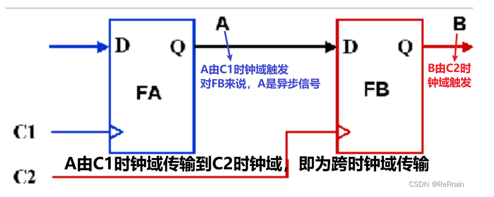
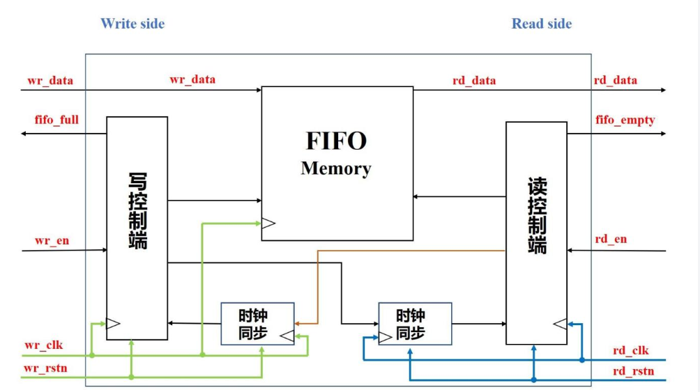
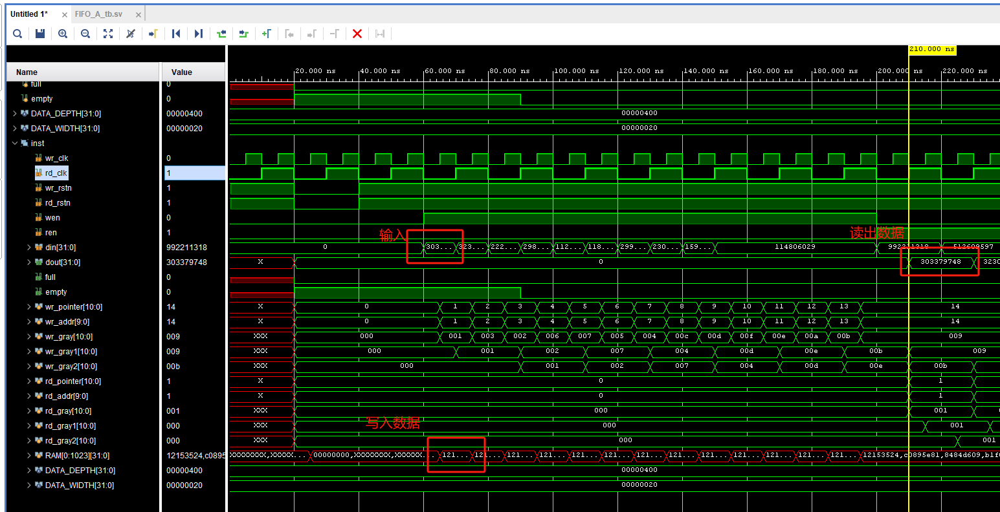
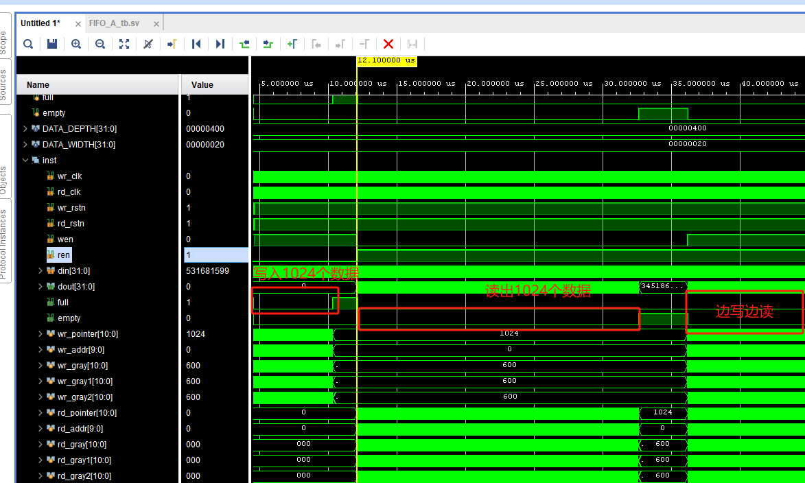

## 任务
设计32位宽，1024深度的异步fifo
## 跨时钟域cdc
优质博客
https://zhuanlan.zhihu.com/p/144888852
https://blog.csdn.net/claylovetoo/article/details/129140192

前者的输出到后者的输入由于两个时钟域不同而不满足后者的建立时间保持时间，从而产生亚稳态。
单bit亚稳态可以使用两级D触发器进行时钟同步消除这种影响，或者说降低亚稳态发生的概率
多bit亚稳态需要使用异步fifo
## 异步fifo设计
优质博客
https://blog.csdn.net/Loudrs/article/details/131021317
结构：

主要考虑空满信号，二进制码转化为格雷码，时钟同步模块
## 结果展示
写使能且未满时，当写时钟上升沿时写入数据
读使能且未空时，当读时钟上升沿时读出数据

空满信号检验
先写入1200个随机数，读信号为0，当写入1024个时full为1，不再写入；
再读出1200个数据，写信号为0，当读出1024个时empty为1，不再读出
