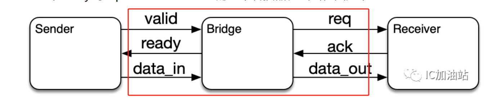
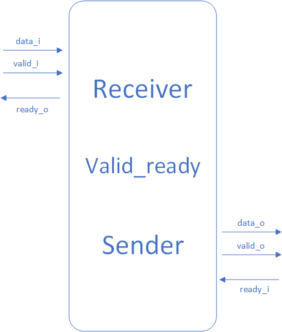
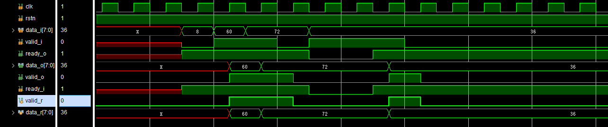
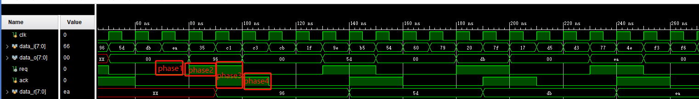

# HANDSHAKE设计

### 设计目标
​	完成流水线控制，实现bridge

## 学习记录
学习博客：
三个协议
https://mp.weixin.qq.com/s/EDAjjVJzzyKstI10fqv6Lw
valid_ready
https://zhuanlan.zhihu.com/p/620498057
https://www.bilibili.com/read/cv16267203/
## valid_ready：
valid和ready互不依赖，想传数据时valid拉高，想接收数据时ready拉高

下一级准备好接收，本级准备好接收
下一级准备好接收，上一级数据有效，则数据存入内部寄存器
本级准备好接收，上一级有效信号存入内部寄存器

## 4_phase Handshake：
4个phase:
phase1: sender和receiver都是idle状态，req和ack都为0；
phase2:  sender拉高req，等待receiver的ack为高，同时驱动要传输的数据，并保持住; 
phase3: receiver拉高ack，此时req和ack同时为高；表示receiver已经接受到了数据；如上图的cycle 4
phase4: sender看到了ack，知道数据传输完成，于是拉低req。
最后receiver看到req被拉低，从而也拉低ack，回到phase1。

也就是每一次传输数据，都需要经过a->b, b->c, c->d的顺序变化。
## bridge：
valid和ready互不依赖，想传数据时valid拉高，想接收数据时ready拉高

下一级准备好接收，本级准备好接收
下一级准备好接收，上一级数据有效，则数据存入内部寄存器
本级准备好接收，上一级有效信号存入内部寄存器

