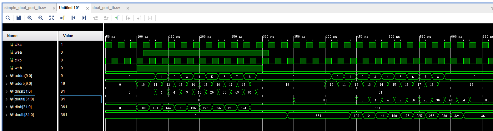

# 设计任务：RAM&DDS

## 	任务一：RAM设计

1.  使用Xilinx的IP

​	使用脚本语言生成初始化RAM的coe文件。 学习单端口，simple dual port和true dual port的工作原理。分别写testbench进行测试。

要求深度1024位宽32。

​	学习RAM读写冲突的读优先、写优先、保持处理模式，在testbench中产生读写冲突进行测试。

2. 使用sv写上述三种RAM

- 设计深度、位宽可配置，读写冲突可配置的单端口，simple dual port和true dual port RAM，学习**综合属性**的相关内容，怎么通过代码指导让ide综合出不同实现形式的RAM。要求设计可配置实现形式（distributed 和 block）

- 使用脚本语言生成初始化RAM的文件，在代码中实现RAM的初始化。

- 完成测试

## 	任务二：DDS设计

​	学习DDS原理，使用任务一完成的RAM设计一个初始相位可调；步长可调；正弦波、方波、三角波可切换的DDS。深度不小于1024，位宽自行决定。

​	完成测试

\*附加：优化DDS的存储方式，只存储半周期或四分之一周期的波形数据，通过算法完成波形恢复。

## 笔记
## 学习博客
如何实现一个RAM？
https://cloud.tencent.com/developer/article/2293273

## RAM：
总的来说：

单端口RAM：A不能同时读写，即A写时不可读，B读时不可写。

伪双端口RAM：AB可同时读写，但仅A写B读。

真双端口RAM：AB可同时读写，A可写可读，B可写可读。
## 单端口： 
输入只有一组数据线和一组地址线，读写共用地址线，输出只有一个端口。这意味着，如果CPU需要读取RAM中的数据并将其写入另一个位置，必须先执行读取操作，然后执行写入操作。这种延迟可能会影响计算机系统的性能。单端口RAM通常用于低端计算机系统或嵌入式系统中。如下图所示：
DINA：数据输入端口A。用于写入操作时输入要存储的数据。
ADDDRA：地址输入端口A。用于指定在写入或读取操作期间访问哪个内存位置。
WEA：写使能信号A。当该信号为高电平时，允许进行写入操作；否则不允许写入。
ENA：芯片使能信号。控制整个RAM芯片是否工作，通常在高电平有效。
RSTA：复位信号。用于将RAM的内容恢复到初始状态，例如清除所有存储的数据。
REGCEA：寄存器时钟使能信号A。在某些设计中可能用于同步读写操作。
CLKA：时钟信号A。用于同步数据的写入和读出操作。
DOUTA：数据输出端口A。在读操作时输出从指定地址获取的数据。
## 伪双端口：
输入有一组数据线，两组地址线，输出只有一个端口。伪双端口RAM可以提供并行读写操作，避免了传统单端口RAM的等待时间，因此有更快的访问速度和响应时间。伪双端口RAM通常广泛应用于高性能数字信号处理器、图像处理器、视频采集卡等领域，以提高存储器的访问速度和效率，满足高速处理的需求。如下图所示：
写数据:
DINA: 写入端口A的数据线。
写地址:
ADDRA: 端口A的写入地址线。
写使能:
WEA: 写入操作使能信号，用于控制是否进行写入操作。
时钟使能:
ENA: 控制端口A的读写操作的使能信号。
写时钟:
CLKA: 端口A的写入时钟信号。
读地址:
ADDR B: 端口B的读取地址线。
读时钟:
CLKB: 端口B的读取时钟信号。
其他功能:
INJECTSBITERR: 注入单比特错误到端口B的信号。
INJECTDBITERR: 注入双比特错误到端口B的信号。
RSTB: 复位端口B的信号。
REGCEB: 端口B寄存器的使能信号。
SBITERR: 单比特错误检测信号。
DBITERR: 双比特错误检测信号。
RDADDRREC: 读取地址记录信号。
DOUTB: 从端口B输出的数据线。
## 双端口：
 输入有两组地址线和两组数据线，输出有两个端口。所以双口RAM两个端口都分别带有读写端口，可以在没有干扰的情况下进行读写，彼此互不干扰。这种RAM通常用于高端计算机系统中，因为它可以提高系统性能。例如，在多处理器系统中，多个处理器可以同时访问同一块双端口RAM，从而提高系统的并行处理能力。如下图所示：
端口A:
数据输入：DINA
地址线：ADDRA
写使能：WEA
使能：ENA
复位：RSTA
寄存器时钟使能：REGCEA
时钟：CLKA
数据输出：DOUTA
端口B:
数据输入：DINB
地址线：ADDRB
写使能：WEB
使能：ENB
复位：RSTB
寄存器时钟使能：REGCEB
时钟：CLKB
数据输出：DOUTB

## 读写冲突
1、读和写冲突：如果读和写同时有效，且读和写是同一个地址时，发生RAM读写冲突，此时会把最新的写数据直接赋给读数据，称为写穿通到读
2、写和写冲突：表示两个端口写使能同时有效且写地址相同，此时需要关断一个写，把两个写端口都需要更新的值处理到一个写端口上面，任何的DP RAM 都不支持写和写冲突。

## 读优先写优先
https://blog.csdn.net/weixin_41230430/article/details/140114728

写优先的特点：当同时请求读和写操作时，写操作会被执行，而读操作会被延迟或返回新写入的数据。
读优先的特点：当同时请求读和写操作时，读操作会被执行，而写操作会被忽略或延迟。
保持状态的特点：当使能信号有效但写使能无效时，RAM的输出保持不变，不进行新的读取操作。

## DDS：
将三角波，正弦波，方波初始化存入单端口RAM，再读出
代码编写时核心思路为
addr <= {phase_MSB,phase}
总数据为1024*3，需要[11:0]的addr
将其分为[1:0]phase_MSB（状态）,以及[9:0]的phase（能寻1024个数据）
设置波形数据

Interpolation Style（插值样式）:
Linear：线性插值，即在两个数据点之间绘制一条直线，用于平滑地连接不同的信号点。
Hold：保持上一个值，通常用于阶梯状波形表示（例如，时钟信号的跳变）。
Off Scale（超出范围的信号处理）:
Hide（隐藏）：当信号超出显示范围时，隐藏该信号。
Clip（裁剪）：将信号裁剪到显示范围的边界，即只显示范围内的部分。
Overlap（重叠）：允许信号超出显示范围并显示重叠部分。

## 结果记录
## 调用IP核
单端口RAM
功能展示(先写后读)：

读写冲突：
写优先（冲突时读新写的）：

读优先（冲突时读原来写得）：

保持模式（写时输出保持不变）：

伪双端口RAM
功能展示（同时A写B读）：

写优先（IP核固定写优先）

真双端口RAM
功能展示：
（A写B读）

（A写A读，B写B读，体现两个端口的独立性）

读写冲突(A写A读B写B读)：
写优先与读优先（A写优先B读优先）：

保持模式：

## 编写RTL
单端口RAM
功能展示(先读后写)：

读写冲突：
写优先(读写穿透)：

读优先：

保持模式：

伪双端口RAM
功能展示（同时A写B读）：

读写冲突：
写优先：

读优先：

保持模式：

真双端口RAM
功能展示（A写B读）：

（A写A读，B写B读，体现两个端口的独立性）

读写冲突（取决于读的端口模式）：
写优先读优先（A写A读，A端口写优先，B写B读，B端口读优先）：

保持模式(A写A读，B写B读，AB都保持)：

综合属性：block/distributed

## DDS
python生成波形数据

结果展示：
