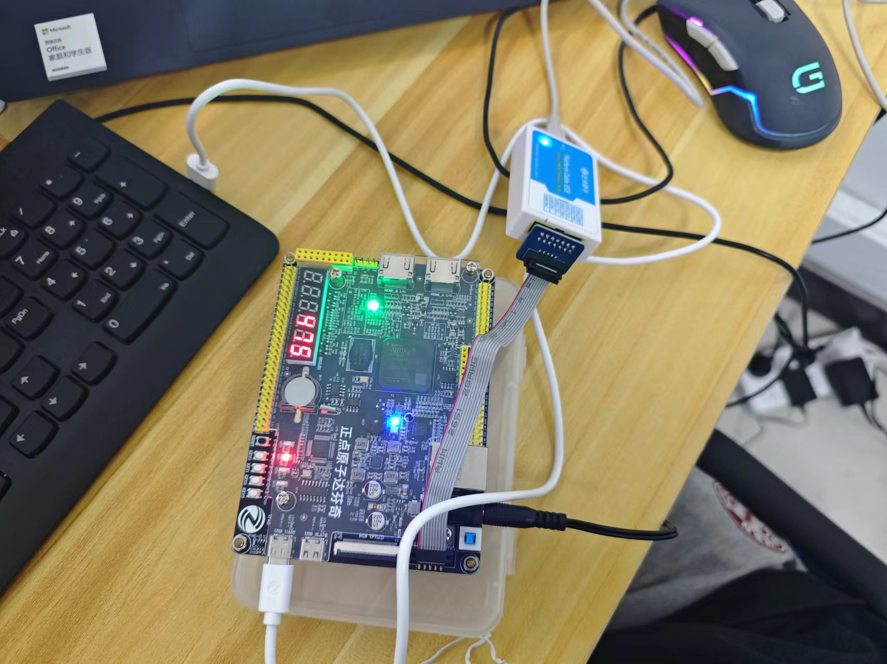

# 设计任务：UART

## 	要求1：尝试迁移到system verilog

 - system verilog部分特性

   - logic数据类型

     可以将所有的数据类型都指定为logic，在综合的过程中会根据具体实现生成时序逻辑或组合逻辑

   - always_ff和always_comb和assign进程

     区分三种进程的使用场景：always_ff在时序逻辑中使用；always_comb用于计算非端口的组合逻辑；assign通常用于将内部信号连接至io端口

   - 枚举类型

     system verilog对状态机的设计进行了优化，推荐使用如下方式构建状态机

     ```systemverilog
     typedef enum logic [2:0] {
         STATE1,
         STATE2,
         STATE3
       } state_t;
       state_t state_reg, state_next;
     ```


## 要求2：参数化的UART设计

​	设计一个数据长度在5~8bit，校验位可选择odd，even和无校验，停止位可选择1或2位。要求波特率可配置，接收机可配置采样点与采样次数。

#### 数据包的构成

Uart协议的传输数据被整合成数据包，每个数据包包含1位起始位，5-9位的数据位（具体决定于需求等因素），1位可选的奇偶校验位和1-2位的停止位。如下图所示：


#### 起始位（start bit）

​	数据传输线空闲的时候保持低电平，当开始传输时，拉低一个时钟周期，这就是起始位。当接受端检测到数据线由高到低的变化时便开始以约定的波特率来接收上述的数据包。

#### 数据帧（data frame）

​	这是实际需要传输的数据。如果使用奇偶校验功能的话，可以传输5-8位的数据；如果不使用奇偶校验功能，则可以传输9位。一般由最低位开始传输。

#### 奇偶校验位（parity）

​	用于接收端判断接收到的数据的正误。当接受端接收到数据帧后，计算其中1的个数是奇数个还是偶数个。如果奇偶校验位是0(偶校验)，那么数据帧中1的个数应该是一个偶数。如果奇偶校验位是1(奇校验)，那么数据帧中1的个数应该是奇数。当奇偶校验位与数据匹配时，传输没有错误。但是如果奇偶校验位是0，但1的个数是奇数或者奇偶校验位是1，个数却是偶数，则数据传输过程中发生了变化。奇偶校验只有粗略判断正误的功能，没有改正的能力。

#### 停止位（stop bits）

高电平保持1-2个时钟周期表示1-2位停止位，即停止位为高电平。

#### 波特率

##### 波特率和比特率

​	比特率：每秒钟传输的二进制位数（bit），表示有效数据的传输速率，单位是b/s 、bit/s、比特/秒，读作：比特每秒。

​	波特率：波特率可以被理解为单位时间内传输符号的个数（传符号率），通过不同的调制方法可以在一个符号上负载多个比特信息。

比特率和波特率在数值上有如下关系：
$$
I=S⋅log2NI=S⋅log2⁡N
$$
​	其中***I*** 为传信率（比特率），***S*** 为波特率，***N*** 为每个符号负载的信息量，而log2Nlog2⁡N以比特为单位。

以RS232为例，假设目前“**波特率**”为 9600， 则此RS232的比特率计算为
$$
I=S⋅log2N=9600⋅log22=9600bit/sI=S⋅log2⁡N=9600⋅log2⁡2=9600bit/s
$$
​	常有人把RS232之*N* 误以为是每个“**符号**”（symbol）所夹带的讯息量为2828，但实际上每一个“**位元**”（bit）即为一个“**符号**”（symbol）。

计算机通信中，波特率与比特率虽在数值上相等，但是它们的意义并不相同。

#### 常见波特率

9600、19200 、38400 、57600 、115200、230400、460800、921600

#### 时钟与波特率的计算

​	FPGA 主频如果为50M，则时钟周期就是20ns。若数据发送速率为9600bps，则一位数据需要的时间为1000000000/9600=104167ns，则FPGA 传送一位需要翻转104167/20=5208个周期才可传送一位，所以程序中需计数5208才可满足9600bps。

​	简单一点就是***时钟频率除以波特率***就是需要的计数。

#### 采样

​	根据uart协议，数据传输线空闲时位高电平，数据传输以一位低电平的起始位开始，因此准确检测起始位是数据成功传输的关键。由于接受端和发送端是异步的，需要专门的边沿检测电路来捕捉下降沿。这里采用4个移位寄存器，连续采集4个时钟上升沿时的数据，通过对比前两个时刻和后两个时刻的数据线的状态来得到数据线准确的下降沿，获得准确的开始接收条件。

​	在简单的串口接收中，我们通常选取一位数据的中间时刻进行采样，因为此时数据最稳定，但是在工业环境中，存在着各种干扰，在干扰存在的情况下，如果采用传统的中间时刻采样一次的方式，采样结果就有可能受到干扰而出错。为了滤除这种干扰，这里采用多次采样求概率的方式。如下图，将一位数据平均分成9个时间段，对位于中间的三个时间段进行采样。然后对三个采样结果进行统计判断，如果某种电平状态在三次采样结果中占到了两次及以上，则可以判定此电平状态即为正确的数据电平。例如4、5、6时刻采样结果分别为1、1、0，那么就取此位解码结果为1，否则，若三次采样结果为0、1、0，则解码结果就为0。即3次采样为a,b,c，则结果为`a&b | b&c |a&c`，显而易见此结果是全加器的进位，[参考链接](https://halftop.github.io/post/verilog99_12to21/#题目012)。


## 要求3：编写TB完成前仿

​	测试方法可采用两种，在tb中构建设计的vip；例化主机和从机，完成两个节点的通信

## 要求4：完成完整设计流程，上板测试
VIVADO全流程
[参考链接](https://blog.csdn.net/weixin_42136437/article/details/125444931)。
注意：新建项目时一定要与开发板型号匹配
整个流程与左侧各个标题顺序一致
## 1.	PROJECT MANAGER
ADD Sources：
design sources为RTL设计；
simulation sources为sim时用的testbench
 
注意设置顶层模块：右击确定顶层模块
 
## 设置ip核
[参考链接](https://blog.csdn.net/qq_40039676/article/details/112131705)。 

找到想用的IP核双击打开（fifo）

左图引脚为IP核全部引脚选择自己用的

full 高电平表示fifo装满
Din[17:0]表示写入的数据
WR_EN写使能 
srst复位


设置IP核

输入的位宽及位个数

Veo为IP核的例化模板可依照调用

## 2.	IP INTEGRATOR
## 3.	SIMULATION
重中之重：tb作为仿真平台检查RTL代码正确性
 

技巧：设定好时间单位足够跑完tb
      Ctlr0操作放大仿真图
      新建文件夹将想看的模块信号放入

Debug：根据报错去sim文件里找错误原因
       如果功能不正确，追根溯源查找问题所在
       对于串口而言，tb中tx模块输出错误，查看tx模块输入以及输出
       没问题查看fifo输入输出，没问题查看rx输入输出，确定问题所在
       对照状态机功能查找错误更简单
## 4.	RTL ANALYSIS
## 5.	SYNTHSIS 

逻辑综合可以得到原理图也可以查看版图

综合后查看连接关系

对管脚进行设置，与FPGA管脚匹配


## 6.	IMPLEMENTATION
布局布线

## 7.	PROGRAM AND DEBUG
[参考链接](https://ee.ac.cn/index.php/archives/544.html)。 

生成烧录文件bit
OPEN TARGET：auto connect
右击program device将代码烧录进fpga

将串口线接好调试

## 原理图

## tb仿真结果

## fpga连接

## 串口功能验证
