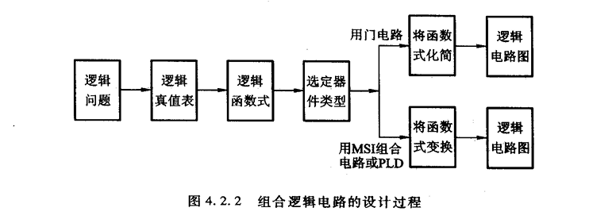

# 数电基础
总结一下，数电这门课程讲了编码，逻辑，组合逻辑电路，触发器，时序逻辑电路以及一些常见模块
包括组合逻辑中的编码器译码器加法器选择器比较器等，触发器中的JK,D,SR,T触发器等，时序逻辑用触发器设计电路的方法以及
时序逻辑电路中的寄存器计数器移位寄存器施密特触发器RAMROM等模块设计

https://blog.csdn.net/m0_46235100/article/details/125449003

### 原码、反码、补码

https://zhuanlan.zhihu.com/p/105917577

### 卡诺图

### 组合逻辑设计路线

### 常用组合逻辑

#### 编码器：

2n个高低电平信号中只有一个为电平有效，其他均为无效

#### 译码器：

由二进制编码对应一位有效的高低电平信号

#### 加法器

#### 数据选择器

### 竞争与冒险

https://www.bilibili.com/video/BV1QQ4y1e7yu/?spm_id_from=333.337.search-card.all.click

### 锁存器
 https://blog.csdn.net/qq_40483920/article/details/108048240
 
### 触发器
https://www.bilibili.com/video/BV12D421A7xq/?spm_id_from=333.337.search-card.all.click&vd_source=a9d595f8eaba495d0340b6ba622b626e

https://cloud.tencent.com/developer/article/1678794
#### D触发器
https://blog.csdn.net/qq_38348090/article/details/103340023

### 脉冲触发器
https://blog.csdn.net/m0_51525427/article/details/125748438
### 状态转移图
https://blog.csdn.net/m0_72073960/article/details/127993269

### 时序逻辑电路
moore以及mealy
https://www.bilibili.com/video/BV1jV4y1L758/?spm_id_from=333.337.search-card.all.click&vd_source=a9d595f8eaba495d0340b6ba622b626e

### 常见的数字逻辑电路
https://www.bilibili.com/video/BV1ZV411E7W5?spm_id_from=333.788.videopod.episodes&vd_source=a9d595f8eaba495d0340b6ba622b626e&p=72
包括寄存器，移位寄存器，RAM，ROM，施密特触发器，计数器，单稳态触发器，AD转换器等